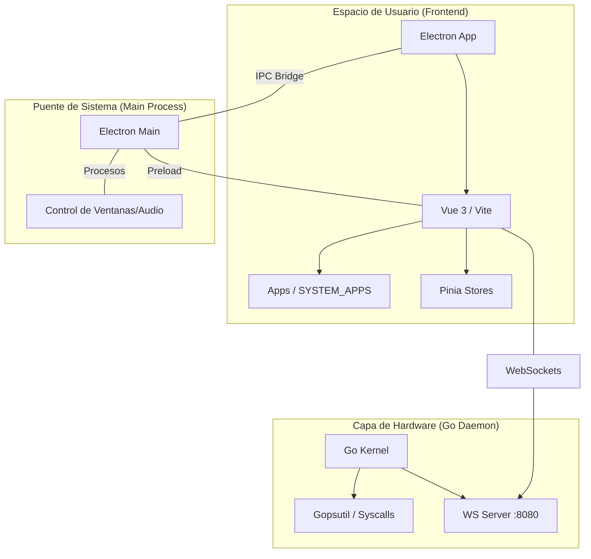

# AntorOS - Desktop Edition 🖥️🌀

[](https://vuejs.org/)
[](https://www.electronjs.org/)
[](https://go.dev/)
[](https://www.typescriptlang.org/)
[](https://vitejs.dev/)
[](LICENSE)

**AntorOS** es un simulador de sistema operativo futurista construido con tecnologías web modernas, diseñado para ofrecer una experiencia de escritorio inmersiva con capacidades de monitorización de hardware en tiempo real.

---

## 🚀 Características Principales

- **Dashboard de Hardware**: Visualización en tiempo real del uso de CPU y RAM gracias a un Daemon nativo escrito en Go.
- **Ecosistema de Apps**: Suite completa de aplicaciones integradas (Navegador, Terminal, Gestor de Archivos, Notas, etc.).
- **Diseño Gamer-Neon**: Interfaz estética con animaciones fluidas y personalización profunda de temas.
- **Arquitectura Híbrida**: Frontend reactivo en Vue 3 y un "Kernel" backend en Go comunicado vía WebSockets para acceso a hardware real.
- **Integración Nativa**: Gracias a Electron, el sistema tiene acceso a APIs de bajo nivel, control de ventanas frameless, y gestión de energía.

---

## 🏗️ Arquitectura del Sistema



---

## 📂 Estructura del Proyecto

- `electron/`: Punto de entrada y configuración de Electron (Main & Preload).
- `src/`: Lógica del frontend Vue 3, componentes, stores de Pinia y estilos CSS.
- `daemon/`: "Kernel" del sistema escrito en Go que gestiona la telemetría del hardware.
- `dist-electron/`: Archivos compilados listos para ejecución en producción.

---

## 🛠️ Requisitos Previos

Antes de comenzar, asegúrate de tener instalado:

- [Node.js](https://nodejs.org/) (v18 o superior)
- [pnpm](https://pnpm.io/) (recomendado) o npm
- [Go](https://go.dev/) (v1.24 o superior) para el Daemon de hardware

---

## ⚡ Procedimiento de Instalación y Ejecución

Sigue estos pasos para poner en marcha el proyecto:

### 1. Clonar el repositorio
```bash
git clone https://github.com/tu-usuario/AntorOS-Desktop-Edition.git
cd AntorOS-Desktop-Edition
```

### 2. Instalar dependencias del Frontend
```bash
pnpm install
```

### 3. Ejecutar el sistema (Modo Desarrollo)

Para que el sistema funcione completamente, se requiere ejecutar tres procesos en terminales separadas:

- **Paso A: Iniciar el Servidor de Desarrollo (Vite)**
  ```bash
  pnpm dev:vue
  ```
  *(Este comando sirve el frontend en http://localhost:3000)*

- **Paso B: Iniciar el Daemon de Hardware (Go Kernel)**
  ```bash
  pnpm dev:daemon
  ```
  *(Este comando activa el puente con el hardware real vía WebSocket)*

- **Paso C: Iniciar la Aplicación de Escritorio (Electron)**
  ```bash
  pnpm dev:electron
  ```
  *(Este comando abre la ventana nativa de AntorOS)*

---

## 🏗️ Empaquetado para Producción

Si deseas generar los binarios finales:

1. **Construir el Frontend y Electron**:
   ```bash
   pnpm build
   ```
2. **Compilar el Daemon de Go**:
   ```bash
   cd daemon
   go build -o antor-os-daemon
   ```

## 📱 Aplicaciones Incluidas

| App | Descripción |
| :--- | :--- |
| **🌐 Navegador** | Navegación web avanzada integrada. |
| **💻 Terminal** | Interfaz de comandos nativa de AntorOS compatible con PTY real. |
| **📁 Archivos** | Gestión y exploración de archivos virtuales. |
| **📊 Monitor** | Estadísticas de hardware (CPU/RAM) en vivo. |
| **⚙️ Ajustes** | Centro de control para personalización y temas. |

---

## 💻 Consola de Comandos (Terminal App)

La aplicación de **Terminal** de AntorOS cuenta con una arquitectura de ejecución mixta (comandos locales emulados e interacción directa PTY):

### 🛠️ Comandos de AntorOS (Emulados en Vue 3 & Pinia)

- **`fastfetch`**: Muestra información física detallada de telemetría del sistema, procesador, GPU y uptime, junto con un arte ASCII cyberpunk en colores ANSI.
- **`antpac`**: Gestor de paquetes virtual integrado con el store de Pinia (`storeStore.ts`) que gestiona el ciclo de vida de aplicaciones de la tienda:
  *   `antpac list`: Muestra la lista de aplicaciones de terceros disponibles para descargar en Cyber Store (No requiere `sudo`).
  *   `sudo antpac install <app_id>`: Requiere autenticación root. Tras validar la contraseña de usuario (`userStore.password`), inicia un proceso interactivo animado de descarga e instalación `[###       ] 30%` con barra de progreso interactiva en consola y persistencia automática en el launcher.
  *   `sudo antpac remove <app_id>`: Requiere autenticación root. Tras validar la contraseña de usuario, desinstala una aplicación de terceros deteniendo y destruyendo de forma segura cualquier ventana de renderizado abierta asociada a ella.
- **`clear`**: Limpia completamente el búfer y el lienzo visible de la consola de comandos.

### 🌐 Comandos del Sistema Anfitrión (Puente PTY de Go)

Cualquier directiva no registrada localmente se enruta en tiempo real a través del WebSocket del Kernel hacia una **Pseudo-Terminal (PTY)** en segundo plano gestionada por el Daemon en Go:
- Los comandos operan bajo un directorio de trabajo seguro y aislado en el host (`~/Documentos/antor-workspace/`) para proteger el sistema anfitrión.
- Permite la ejecución e interacción con utilidades reales del sistema operativo anfitrión como:
  *   `ls` / `dir`: Listar archivos locales de trabajo.
  *   `pwd`: Mostrar la ruta absoluta de ejecución.
  *   `mkdir <dir_name>`: Crear directorios.
  *   `touch <file_name>`: Crear archivos planos.
  *   Cualquier comando de bash compatible en la shell de la máquina anfitriona.

---

## 📜 Licencia

Este proyecto está bajo la Licencia MIT. Consulta el archivo [LICENSE](LICENSE) para más detalles.

---

<p align="center">
  Hecho con ❤️ para la clase de Sistemas Operativos
</p>

